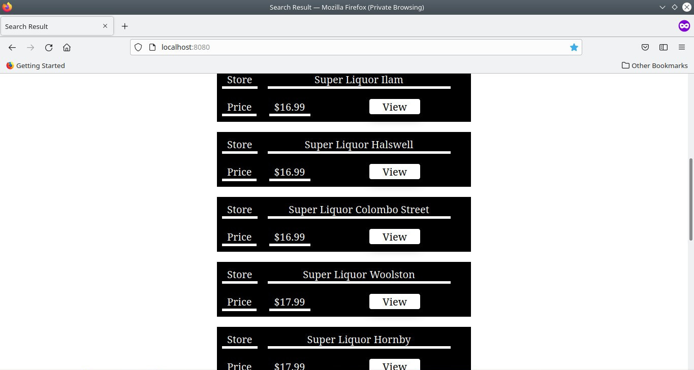
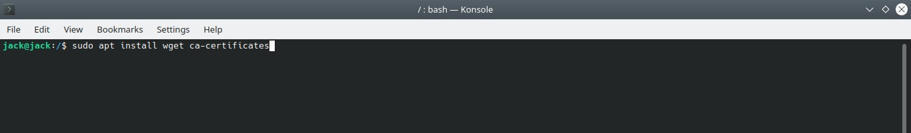
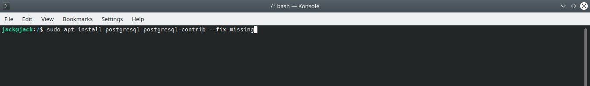

# Beer Finder N.Z.
> a Spring app that uses a Web Scraper tool and a PostgreSQL database to find beer in New Zealand.

## Table of Contents
* [General Info](#general-information)
* [Technologies Used](#technologies-used)
* [Features](#features)
* [Screenshots](#screenshots)
* [Setup](#setup)
* [Fix PostgreSQL Authentication error (Linux)](#fix_postgresql_authentication_error_linux)
* [Project Status](#project-status)
* [Room for Improvement](#room-for-improvement)


## General Information
- This application was created for the ["7 Aplicaciones que debes construir - desafío de código"](https://www.youtube.com/watch?v=psSO3T7gslU) code challenge launched by [Nicolás Schürmann](https://twitter.com/_nasch_) from the [HolaMundo](https://www.youtube.com/channel/UC4FHiPgS1KXkUMx3dxBUtPg) YouTube Channel.

## Technologies Used
BackEnd
- Java 11
- Spring - version 2.6.7
- Spring Data JPA
- Spring Web
- Thymeleaf
- Jsoup - version 1.14.3
- JDBC PostgreSQL Driver

FrontEnd
- HTML
- CSS
- JavaScript

Tools
- Nano - version 5.2
- PostgreSQL - version 13
- DBeaver

OS
- Ubuntu 20.10

## Features
The database of this app covers : 
- 15 Regions of the 16 Regions of New Zealand.
- 91 Cities/Towns.
- 192 Stores.
- 4 Store Franchises : Big Barrel, FreshChoice, Super Liquor and SuperValue.

## Screenshots





## Setup
0. [Java OpenJDK 11 Setup (Linux)](#java-openjdk11-linux-setup)
1. [PostgreSQL Server Setup (Linux)](#postgresql-linux-setup)
2. [Check the PostgreSQL Port (Linux)](#check-the-postgresql-port-linux)
3. [Configure PostgreSQL Server (Linux)](#configure-postgresql-server-linux)
4. [Clone GitHub Repository (Linux)](#clone-github-repository-linux)
5. [Execute the SQL Scripts (Linux)](#execute-the-sql-scripts-linux)
6. [Compile and Run the Project (Linux)](#compile-and-run-the-project-linux)


## Java OpenJDK 11 Linux Setup
Extracted from the [How to Install Java on Ubuntu 18.04](https://linuxize.com/post/install-java-on-ubuntu-18-04/) from https://linuxize.com

0. Open a Terminal.

1. First, update the apt package index with:
```
	$ sudo apt update
```


2. Once the package index is updated install the Java OpenJDK 11 package with:
```
	$ sudo apt install openjdk-11-jdk
```


3. Verify the installation, by running the following command which will print the Java version:
```
	$ java --version
```


## PostgreSQL Linux Setup

Extracted from the [How to Instsall and Setup PostgreSQL Server on Linux on Ubuntu 20.04](https://www.cherryservers.com/blog/how-to-install-and-setup-postgresql-server-on-ubuntu-20-04) from https://www.cherryservers.com

0. Open a Terminal
1. First, you should install prerequisite software packages that will be used to download and install software certificates for a secure SSL connection.
```
	$ sudo apt install wget ca-certificates
```


2. Then, get the certificate, add it to apt-key management utility and create a new configuration file with an official PostgreSQL repository address inside.
```
	$ wget --quiet -O - https://www.postgresql.org/media/keys/ACCC4CF8.asc | sudo apt-key add -
```


```
	$ sudo sh -c 'echo "deb http://apt.postgresql.org/pub/repos/apt/ $(lsb_release -cs)-pgdg main" >> /etc/apt/sources.list.d/pgdg.list'
```


3. It is always a good idea to download information about all packages available for installation from your configured sources before the actual installation.
```
	$ sudo apt update
```


4. Now is the time to do the actual PostgreSQL installation. This will install the latest PostgreSQL version along with the newest extensions and additions that are not yet officially part of the PostgreSQL core.
```
	$ apt install postgresql postgresql-contrib
```


4. Note : To avoid missing dependencies errors, run this instead 
```
	$ apt install postgresql postgresql-contrib --fix-missing
```


5. After the installation you may double-check that postgresql daemon is active.
```
	$ sudo systemctl status postgresql
```


## Check the PostgreSQL Port Linux
0. Open a Terminal
1. To see the PostgreSQL port run :
```
	$ sudo lsof -i -P  -n | grep LISTEN
```


2. If the PostgreSQL service is not running on 5432 port, you have two options :
	> a - change the port in the 'application.properties' file.
	
	> b - change the PostgreSQL service port in the 'postgresql.conf' file.


## Change the PostgreSQL Port Linux
0. Open a Terminal
1. Open the 'postgresql.conf' file with nano.
```
	$ sudo nano /etc/postgresql/13/main/postgresql.conf
```


2. Find the 'port' line (line number 64) and change port number to 5432, press ctrl + s  to save and ctrl + x to close nano.


3. Restart the PostgreSQL service :
```
	$ sudo systemctl restart postgresql
```


4. Check the PostgreSQL service :
```
	$ sudo systemctl status postgresql
```


5. Check the PostgreSQL service port :
```
	$ sudo lsof -i -P  -n | grep LISTEN
```


## Configure PostgreSQL Server Linux
0. Open a Terminal.
1. Connect to PostgreSQL Server through psql :
```
	$ sudo -u postgres psql
```


2. Create a new database called 'app' :
```
	postgres=# create database app;
```


3. Create a the 'test' user with the 'test' password in the PostgreSQL Server :
```
	postgres=# create user test with encrypted password 'test';
```


4. Give privileges to 'test' user :
```
	postgres=# grant all privileges on database app to 'test';
```


## Clone GitHub Repository Linux
0. Open a Terminal.

1. Choose a directory, in this example will be '.../Documents/Git/' :


2. Clone the repository :
```
	$ git clone https://github.com/JulianDbs/BeerFinderNZ.git 
```


## Execute the SQL Scripts Linux
0. Open a Terminal.
1. Try to login as 'test' (password : test) :
```
	$ sudo psql -U test app
```


2. If you login successfully, exit from psql using the '\q' command, if you get an error go to [here](#fix-postgresql-authentication-error-linux).
```
	app=> \q
```


3. Go to the 'SQL' folder in the project main directory : 
```
	$ cd BeerFinderNZ/SQL/
```


4. Execute the 'script_0_create_tables.sql' :
```
	$ sudo psql test -h 127.0.0.1 -d app -f script_0_create_tables.sql
```


5. Execute the 'script_1_insert_data.sql' :
```
	$ sudo psql test -h 127.0.0.1 -d app -f script_1_insert_data.sql
```


6. Check the tables in the 'app' database :
```
	app=> \d
```


## Fix PostgreSQL Authentication error Linux
If you get the "psql: error: FATAL: Peer authentication failed for user 'test'" error 


You can fix it following this steps :

0. Open a Terminal.
1. Open the 'pg_hba.conf' file in the '/etc/postgresql/13/main/' directory :
```
	$ sudo nano /etc/postgresql/13/main/pg_hba.conf 
```


2. Find the line :
```
	 # local         DATABASE  USER  ADDRESS  METHOD  [OPTIONS]
```


3. and add :
```
	local app test  md5
```


4. Press ctrl + s to save the changes and press ctrl + x to exit.
5. Restart the PostgreSQL service with this command :
```
	$ sudo systemctl restart postgresql
```


6. Get the status of the PostgreSQL service :
```
	$ sudo systemctl status postgresql
```


## Compile and Run the Project Linux
0. Open a Terminal.
1. Go to the project main directory :


2. Execute the gradle bootJar command :
```
	$ sudo ./gradlew bootJar
```


3. Execute the .jar
```
	$ java -jar ./build/libs/beerfindernz-0.0.1-SNAPSHOT.jar
```


4. Open your favorite web browser and go to 'http://localhost:8080/'


5. To stop it press ctrl + c


## Project Status
Project is: _in progress_

## Room for Improvement
Room for improvement:
- Maori language interface support ?
- Dark/Light theme mode ?
- Add more stores ?

To do:
- Add filter to forbidden characters (!"#$%&...).
- Add JUnit Tests.
